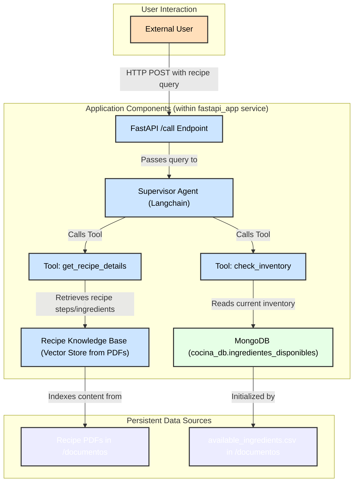

# Multi Agent Solution Recipe 🍷

Here you will find and agentic solution to read multiple sources in this case we use MogoDB and a Knowledge Base loaded from PDFs to a vector store. The Supervisor will call receipt to know the ingredients and mongoDB to know which of those are available. Only set your OPENAI_API_KEY on docker compose and build.

## Tools Used
* FastAPI
* Langchain
* Docker
* OpenAI (Agents, Embeddings)
* Gemini 2.5 + Cursor

## Service Curl

```
curl --location 'localhost:8000/call' \
--header 'Content-Type: application/json' \
--data '{
    "prompt":"Puedo hacer pasta carbonara?"
}'
```

## Diagram

