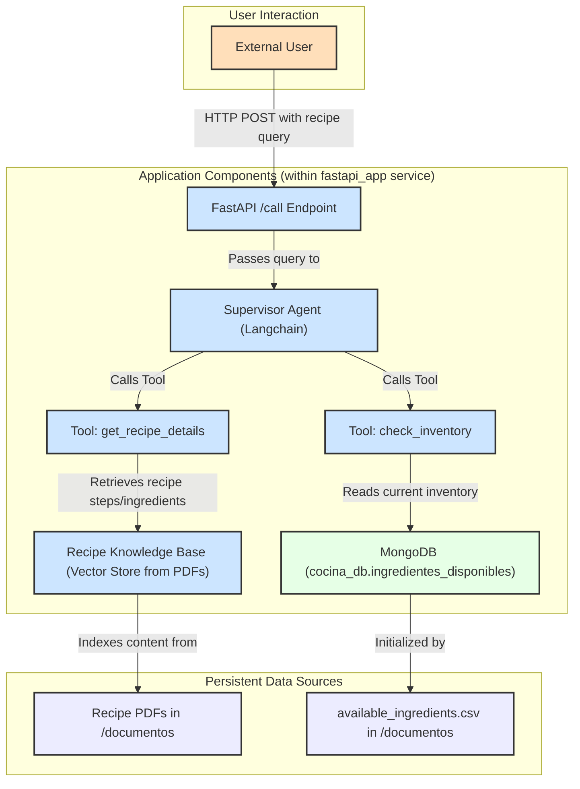

```mermaid
graph TD
    subgraph "User Interaction"
        User["External User"]
    end

    subgraph "Application Components (within fastapi_app service)"
        APIServer["FastAPI /call Endpoint"]
        SupervisorAgent["Supervisor Agent (Langchain)"]
        ToolCheckInventory["Tool: check_inventory"]
        ToolGetRecipe["Tool: get_recipe_details"]
        RecipeKnowledgeBase["Recipe Knowledge Base (Vector Store from PDFs)"]
        MongoDB["MongoDB (cocina_db.ingredientes_disponibles)"]
    end

    subgraph "Persistent Data Sources"
        RecipePDFs["Recipe PDFs in /documentos"]
        AvailableIngredientsCSV["available_ingredients.csv in /documentos"]
    end

    User -->|"HTTP POST with recipe query"| APIServer;
    APIServer -->|"Passes query to"| SupervisorAgent;
    SupervisorAgent -->|"Calls Tool"| ToolCheckInventory;
    ToolCheckInventory -->|"Reads current inventory"| MongoDB;
    SupervisorAgent -->|"Calls Tool"| ToolGetRecipe;
    ToolGetRecipe -->|"Retrieves recipe steps/ingredients"| RecipeKnowledgeBase;

    RecipeKnowledgeBase --"Indexes content from"--> RecipePDFs;
    MongoDB --"Initialized by"--> AvailableIngredientsCSV;

    classDef user fill:#ffdfba,stroke:#333,stroke-width:2px;
    class User user;
    classDef app fill:#cce5ff,stroke:#333,stroke-width:2px;
    class APIServer,SupervisorAgent,ToolCheckInventory,ToolGetRecipe,RecipeKnowledgeBase app;
    classDef service fill:#e6ffe6,stroke:#333,stroke-width:2px;
    class MongoDB, service;
    classDef datastyle fill:#lightgrey,stroke:#333,stroke-width:2px;
    class RecipePDFs,AvailableIngredientsCSV datastyle;
``` 